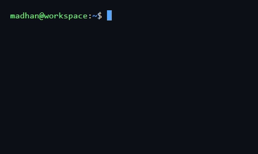
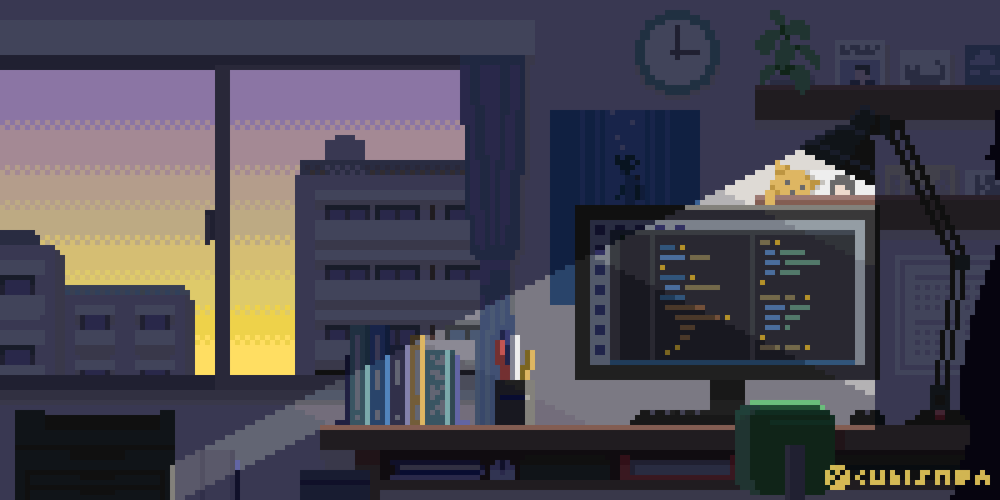

  <b>CS Undergrad @ HITAM · Hyderabad, India</b> 
  Full-Stack · Flutter · AI/ML · AWS &nbsp;|&nbsp; Open to SWE Internships

  
*If I followed you, your work stood out. I enjoy building in public, Always up for connecting with people shipping real work.*

## > behind the keyboard.

  
  

| now | always |
|-----|--------|
| building [Flick](https://github.com/madhanio/flick) — zero-server cross-platform clipboard sync | obsessed with systems that scale |
| exploring local-first P2P & encrypted protocols | full-stack by necessity, AI by choice |
| open to SWE / AI internships | shipping > perfecting |

  

## > under the hood.

  

## > what i've shipped.

    
    
    

## > git status.

  
  

 

  
*currently: shipping [Flick](https://github.com/madhanio/flick) — GitHub dev discovery with NVIDIA NIM LLMs.*

## > reach out.

  If you liked what you saw, let's connect.

  
  &nbsp;&nbsp;&nbsp;&nbsp;
  
  &nbsp;&nbsp;&nbsp;&nbsp;
  

