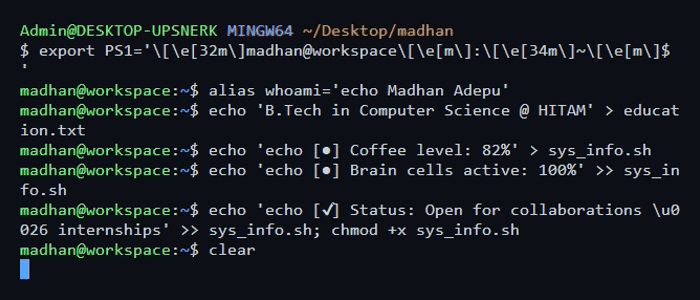

  <b>CS Undergrad @ HITAM · Hyderabad, India</b> 
  Full-Stack · Flutter · AI/ML · AWS &nbsp;|&nbsp; Open to SWE Internships

  
  &nbsp;&nbsp;&nbsp;&nbsp;
  

> hey. welcome to the workspace

*If you're reading this because I followed you — your work genuinely caught my eye.
I build in public too, and I follow people whose commits say more than their bio.
No pressure to follow back, but if you do, let's keep building.*

## > who am i?

  
  

## > what i build with.

  

## > stuff i've shipped.

    
    
<!-- PLACEHOLDER_FOR_FUTURE_PROJECT: Add your DSA Solutions or third major project here -->

## > how it's going.

  
  

 

>*currently: shipping, grinding, and figuring out what's next.*

